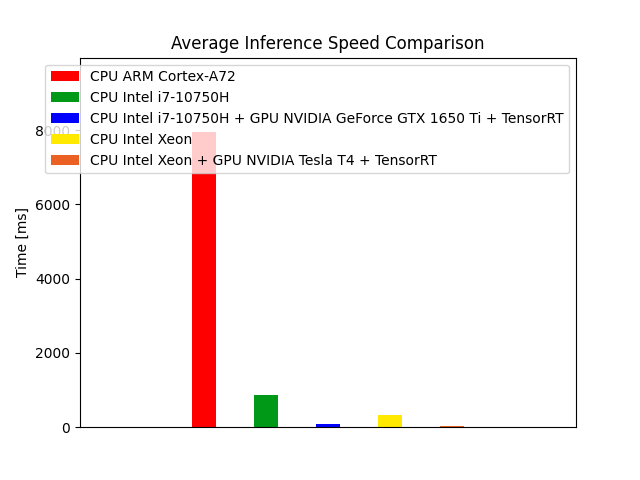

# EuPilot CINI - YOLOv5 Man Down Tracking

This repository contains a configurable man down tracker. The detections generated by YOLOv5, one of the most popular object detection algorithm, are passed to the DeepSORT algorithm that implements tracking and counting tasks.

***

## Algorithm informations

Algorithm inputs:
- YOLOv5 model weights (such as 'yolov5s', 'yolov5l', 'yolov5x', etc..) 
- Re-Identification model weights (such as 'osnet_x0_25.pt', 'osnet_x0_75.pt', etc...)
- Source path (path of the video file that sould be process)

Algoritm outputs:
- Folder that contains video/videos processed

Formats accepted:
- IMG_FORMATS = 'bmp', 'dng', 'jpeg', 'jpg', 'mpo', 'png', 'tif', 'tiff', 'webp'  # include image suffixes
- VID_FORMATS = 'asf', 'avi', 'gif', 'm4v', 'mkv', 'mov', 'mp4', 'mpeg', 'mpg', 'ts', 'wmv'  # include video suffixes

***

## Installation and usage

In a work environment with **Python>=3.7** and **torch>=1.7** installed, clone this repository using the following commands:
```
git clone https://github.com/federicorossifr/eupilot-cini-mandown.git
```
Then, clone and install the official YOLOv5 repository using the following commands:
```
cd eupilot-cini-mandown
git clone https://github.com/ultralytics/yolov5  # clone
cd yolov5
pip install -r requirements.txt  # install
```
Finally, install requirements using the following commands:
```
cd ..
pip install -r requirements.txt  # install
```
Execute code:
```
python man_down_tracking.py
```

Sources:

    0, 1, 2, ...                     # webcam
    img.jpg                          # image
    vid.mp4                          # video
    path/                            # directory
    'path/*.jpg'                     # glob
    'https://youtu.be/Zgi9g1ksQHc'   # YouTube
    'rtsp://example.com/media.mp4'   # RTSP, RTMP, HTTP stream

Weights:

    yolov5s.pt                 # PyTorch
    yolov5s.onnx               # ONNX Runtime
    yolov5s.engine             # TensorRT

***
## Benchmark

All the tests are made using YOLOv5x model and OSNet x1.0
   
platform 1: **Intel i7-10750H**     
platform 2: **Intel i7-10750H + NVIDIA GeForce GTX 1650 Ti + TensorRT**    
platform 3: **Intel Xeon**     
platform 4: **Intel Xeon + NVIDIA Tesla T4 + TensorRT**  
platform 5: **ARM Cortex-A72**  
platform 6: **ARM Neoverse N1**  
platform 7: **Fujitsu A64FX** (ARMv8-A based)

| Platform | FPS | YOLO Inference Speed<br>(ms) | Man Down Classifier Speed<br>(ms) | DeepSORT Speed<br>(ms) | CPU Temperature<br>(°C) | CPU Power Consumption<br>(W) | GPU Temperature<br>(°C) | GPU Power Consumption<br>(W) |
|:-:|:-:|:-:|:-:|:-:|:-:|:-:|:-:|:-:|
| 1 | 1.1 | **822** | 0.3 | 39.8 | 95 | Not Measured | - | - |
| 2 | 6.1 | **86.3** | 0.3 | 38.4 | 75 | Not Measured | 76.4 | 40.8 |
| 3 | 1.6 | **574** | 0.4 | 25.4 | Not Measured | Not Measured | - | - |
| 4 | 10.9 | **37.6** | 0.3 | 27.8 | Not Measured | Not Measured | 49.1 | 55.8 |
| 5 | 0.1 | **7572** | 1.2 | 335 | 82 | Not Measured | - | - |
| 6 | - | **-** | - | - | - | - | - | - |
| 7 | - | **-** | - | - | - | - | - | - |

<!-- <p align = "center"></p> -->

***

#### Ultralytics YOLOv5 GitHub Official Repository
https://github.com/ultralytics/yolov5

***

#### DeepSORT GitHub Official Repository
https://github.com/nwojke/deep_sort