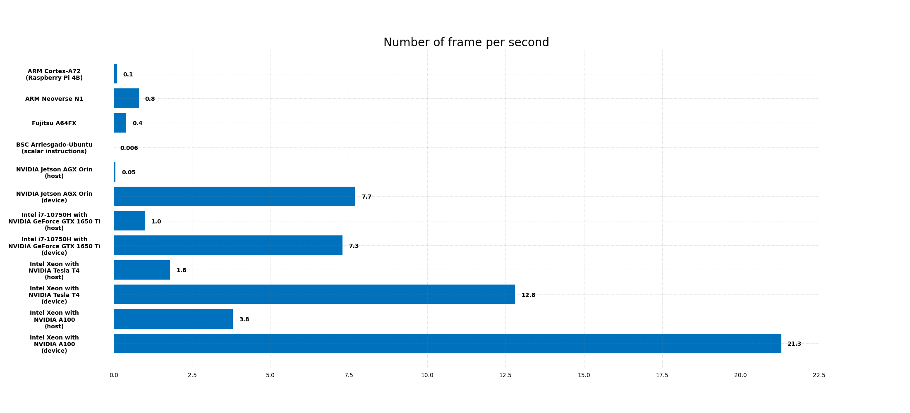
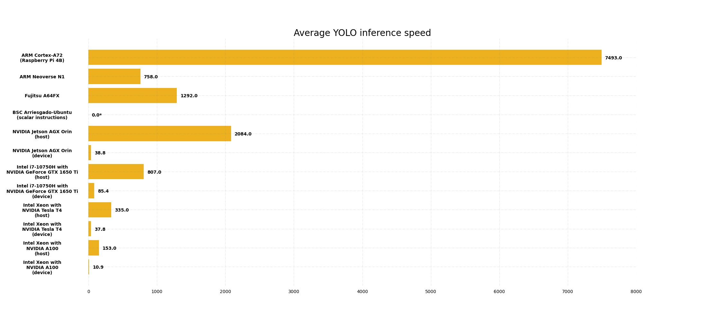
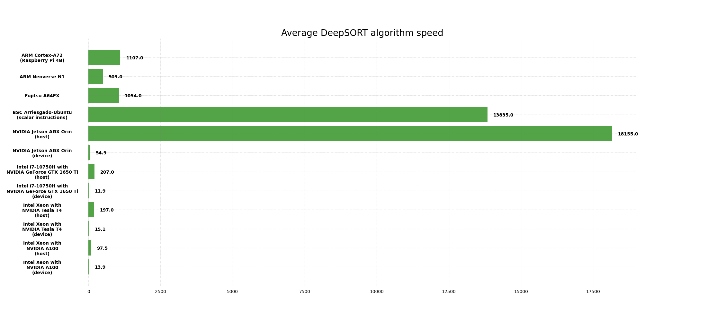
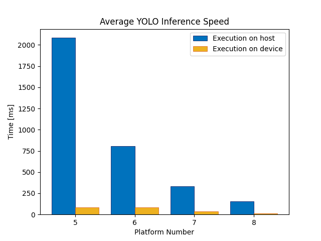

<p align = "center"></p>

# EuPilot CINI - Man Down Tracking

This repository contains the man down tracking application developed by UniPi (in collaboration with Leonardo) used as AI video processing use case in the EUPilot project.  

The detections generated by YOLO (You Only Look Once), one of the most popular object detection algorithm, are passed to the DeepSORT (Simple Online and Realtime Tracker) algorithm that implements tracking and counting tasks.

***

## General informations

Algorithm inputs:
- YOLOv5 model weights (such as 'yolov5s.pt', 'yolov5l.pt', 'yolov5x.pt', etc..) 
- Re-Identification model weights (such as 'osnet_x1_0_market1501.pt', 'osnet_x0_75_market1501.pt', 'osnet_x0_25_market1501.pt', etc...)
- Source path (path of the video file that sould be process)

Algorithm outputs:
- Folder that contains video/videos processed

***

## Installation and usage

In a work environment with **Python>=3.7** and **torch>=1.7** installed, clone this repository using the following commands:
```
git clone https://github.com/federicorossifr/eupilot-cini-mandown.git
```
Then, clone and install the official YOLOv5 repository using the following commands:
```
cd eupilot-cini-mandown
git clone https://github.com/ultralytics/yolov5  # clone
cd yolov5
git checkout tags/v6.2  # checkout at tag 6.2
pip install -r requirements.txt  # install
```
Finally, install requirements using the following commands:
```
cd ..
pip install -r requirements.txt  # install
```
**Execute algorithm**:
```
python man_down_tracking.py
```

Sources:

    0, 1, 2, ...                     # webcam
    vid.mp4                          # video
    'https://youtu.be/Zgi9g1ksQHc'   # YouTube
    'rtsp://example.com/media.mp4'   # RTSP, RTMP, HTTP stream

Weights:

    yolov5s.pt                 # PyTorch
    yolov5s.onnx               # ONNX Runtime
    yolov5s.engine             # TensorRT

Models Size:

    'n'   # nano (3.9 MB)
    's'   # small (14.1 MB)
    'm'   # medium (40.8 MB)
    'l'   # large (89.3 MB)
    'x'   # extra large (166 MB)

***
## Evaluation

Tests have been conducted on different platforms using YOLOv5x model and OSNet x1.0 model.  
Three video test with different number of man down has been used to evaluate the computation performance of the platforms:
- **vid1.mp4**: 470 frames, 3 persons, 3 man down, images size of 384x640
- **vid2.mp4**: 437 frames, 2 persons, 2 man down, images size of 384x640
- **vid3.mp4**: 501 frames, 5 persons, 2 man down, images size of 384x640     

**Platforms**   
- platform 1: **ARM Cortex-A72** (Raspberry Pi 4B)
- platform 2: **ARM Neoverse N1** (10 threads)
- platform 3: **Fujitsu A64FX** (ARMv8-A based, 24 threads)
- platform 4: **BSC RISC-V Arriesgado** (scalar instructions, 4 threads)
- platform 5: **NVIDIA Jetson AGX Orin**  
- platform 6: **Intel i7-10750H with NVIDIA GeForce GTX 1650 Ti**  
- platform 7: **Intel Xeon with NVIDIA Tesla T4**  
- platform 8: **Intel Xeon with NVIDIA A100**   

**Legend**   
:turtle:: Execution on CPU (host)   
:rocket:: Execution on CPU and GPU (device)   
NA: Not Available   

### **Speed**   

| Platform | FPS | YOLO Inference Speed<br>(ms) | Man Down Classifier Speed<br>(ms) | DeepSORT Speed<br>(ms) |
|:-:|:-:|:-:|:-:|:-:|
| 1 | 0.1 | 7493 | 1.2 | 1107 |
| 2 | 0.8 | 758 | 0.6 | 503 |
| 3 | 0.4 | 1292 | 1.1 | 1054 |
| 4 | 0.006 | 148987 | 2.6 | 13835 |
| 5 (:turtle:) | 0.05 | 2084 | 0.5 | 18155 |
| 5 (:rocket:) | 7.7 | 38.8 | 0.5 | 54.9 |
| 6 (:turtle:) | 1.0 | 807 | 0.2 | 207 |
| 6 (:rocket:) | 7.3 | 85.4 | 0.3 | 11.9 |
| 7 (:turtle:) | 1.8 | 335 | 0.3 | 197 |
| 7 (:rocket:) | 12.8 | 37.8 | 0.3 | 15.1 |
| 8 (:turtle:) | 3.8 | 153 | 0.4 | 97.5 |
| 8 (:rocket:) | 21.3 | 10.9 | 0.3 | 13.9 |

***

### **Stats**
| Platform | CPU Utilization Rate <br>(%) | CPU Temperature<br>(°C) | CPU Power Consumption<br>(W) | GPU Utilization Rate <br>(%) | GPU Temperature<br>(°C) | GPU Power Consumption<br>(W) |
|:-:|:-:|:-:|:-:|:-:|:-:|:-:|
| 1 | 96.6 | 83.0 | NA | - | - | - |
| 2 | 5.8 | 51.7 | NA | - | - | - |
| 3 | 39.5 | NA | NA | - | - | - |
| 4 | 79.4 | 42.5 | NA | - | - | - |
| 5 (:turtle:) | 98.3 | 58.2 | 16.8 | - | - | - |
| 5 (:rocket:) | 45.7 | 52.2 | 6.7 | 34.1 | 47.0 | 16.0 |
| 6 (:turtle:) | 40.8 | 91.8 | 43.2 | - | - | - |
| 6 (:rocket:) | 32.1 | 93.5 | 36.2 | 65.8 | 78.7 | 41.2 |
| 7 (:turtle:) | 93.5 | NA | NA | - | - | - |
| 7 (:rocket:) | 49 | NA | NA | 54.0 | 43.7 | 62.5 |
| 8 (:turtle:) | 50.8 | 40.3 | NA | - | - | - |
| 8 (:rocket:) | 25.9 | 32.3 | NA | 30.2 | 38.9 | 51.9 |

***
### **Plots**

- **Comparison between different platforms in terms of FPS**
<p align="center">
  
</p>

- **Comparison between different platforms in terms of YOLOv5 inference speed**
<p align="center">
  
</p>

<br>*out of scale

- **Comparison between different platforms in terms of DeepSORT algorithm execution speed**
<p align="center">
  
</p>

- **YOLO inference speed comparison executing on host or device for different NVIDIA platforms**
<p align="center">
  
</p>

- **Evaluation on ARM Neoverse N1**

<p align="center">
  
   
</p>

<p align = "center">  


- **Evaluation on Fujitsu A64FX**

<p align="center">
  
   
</p>

<p align = "center">  

- **Evaluation on BSC RISC-V Arriesgado platform with scalar instructions**

<p align="center">
  
   
</p>

<p align = "center">  

***

#### Ultralytics YOLOv5 GitHub Official Repository
https://github.com/ultralytics/yolov5

***

#### DeepSORT GitHub Official Repository
https://github.com/nwojke/deep_sort