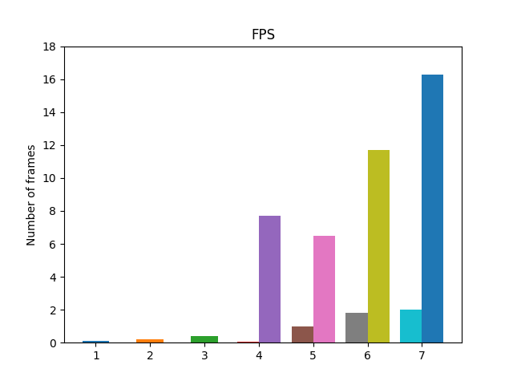

# EuPilot CINI - YOLOv5 Man Down Tracking

This repository contains a configurable man down tracker. The detections generated by YOLOv5, one of the most popular object detection algorithm, are passed to the DeepSORT algorithm that implements tracking and counting tasks.

***

## Algorithm informations

Algorithm inputs:
- YOLOv5 model weights (such as 'yolov5s.pt', 'yolov5l.pt', 'yolov5x.pt', etc..) 
- Re-Identification model weights (such as 'osnet_x1_0_market1501.pt', 'osnet_x0_75_market1501.pt', 'osnet_x0_25_market1501.pt', etc...)
- Source path (path of the video file that sould be process)

Algorithm outputs:
- Folder that contains video/videos processed

***

## Installation and usage

In a work environment with **Python>=3.7** and **torch>=1.7** installed, clone this repository using the following commands:
```
git clone https://github.com/federicorossifr/eupilot-cini-mandown.git
```
Then, clone and install the official YOLOv5 repository using the following commands:
```
cd eupilot-cini-mandown
git clone https://github.com/ultralytics/yolov5  # clone
cd yolov5
git checkout tags/v6.2  # checkout at tag 6.2
pip install -r requirements.txt  # install
```
Finally, install requirements using the following commands:
```
cd ..
pip install -r requirements.txt  # install
```
**Execute algorithm**:
```
python man_down_tracking.py
```

Sources:

    0, 1, 2, ...                     # webcam
    vid.mp4                          # video
    'https://youtu.be/Zgi9g1ksQHc'   # YouTube
    'rtsp://example.com/media.mp4'   # RTSP, RTMP, HTTP stream

Weights:

    yolov5s.pt                 # PyTorch
    yolov5s.onnx               # ONNX Runtime
    yolov5s.engine             # TensorRT

Models Sizes:

    'n'   # nano (3.9 MB)
    's'   # small (14.1 MB)
    'm'   # medium (40.8 MB)
    'l'   # large (89.3 MB)
    'x'   # extra large (166 MB)

***
## Benchmark

All the tests are made using YOLOv5x model and OSNet x1.0 model.

**Platforms tested**:   
- platform 1 --> **ARM Cortex-A72** (Raspberry Pi 4B)  
- platform 2 --> **ARM Neoverse N1**  
- platform 3 --> **Fujitsu A64FX** (ARMv8-A based)  
- platform 4 --> **NVIDIA Jetson AGX Orin**  
- platform 5 --> **Intel i7-10750H with NVIDIA GeForce GTX 1650 Ti**  
- platform 6 --> **Intel Xeon with NVIDIA Tesla T4**  
- platform 7 --> **Intel Xeon with NVIDIA A100**   

**Legend**:  
:turtle: --> execution on CPU  
:rocket: --> execution on CPU and GPU  
NM --> Not Available

### **Speed results**   

| Platform | FPS | YOLO Inference Speed<br>(ms) | Man Down Classifier Speed<br>(ms) | DeepSORT Speed<br>(ms) |
|:-:|:-:|:-:|:-:|:-:|
| 1 | 0.1 | 7632 | 1.2 | 1032 |
| 2 | 0.2 | 879 | 0.6 | 3794 |
| 3 | 0.4 | 1221 | 1.1 | 1233 |
| 4 (:turtle:) | 0.05 | 2084 | 0.5 | 18155 |
| 4 (:rocket:) | 7.7 | 38.8 | 0.5 | 54.9 |
| 5 (:turtle:) | 1.0 | 807 | 0.2 | 207 |
| 5 (:rocket:) | 7.3 | 85.4 | 0.3 | 11.9 |
| 6 (:turtle:) | 1.8 | 335 | 0.3 | 197 |
| 6 (:rocket:) | 12.8 | 37.8 | 0.3 | 15.1 |
| 7 (:turtle:) | 3.8 | 153 | 0.4 | 97.5 |
| 7 (:rocket:) | 21.3 | 10.9 | 0.3 | 13.9 |

***

### **Stats results**
| Platform | CPU Utilization Rate <br>(%) | CPU Temperature<br>(°C) | CPU Power Consumption<br>(W) | GPU Utilization Rate <br>(%) | GPU Temperature<br>(°C) | GPU Power Consumption<br>(W) |
|:-:|:-:|:-:|:-:|:-:|:-:|:-:|
| 1 | 96.8 | 82.0 | NA | - | - | - |
| 2 | 37.5 | 51.7 | NA | - | - | - |
| 3 | 77.1 | NA | NA | - | - | - |
| 4 (:turtle:) | 98.3 | 58.2 | 16.8 | - | - | - |
| 4 (:rocket:) | 45.7 | 52.2 | 6.7 | 34.1 | 47.0 | 16.0 |
| 5 (:turtle:) | 40.8 | 91.8 | 43.2 | - | - | - |
| 5 (:rocket:) | 32.1 | 93.5 | 36.2 | 65.8 | 78.7 | 41.2 |
| 6 (:turtle:) | 93.5 | NA | NA | - | - | - |
| 6 (:rocket:) | 49 | NA | NA | 54.0 | 43.7 | 62.5 |
| 7 (:turtle:) | 50.8 | 40.3 | NA | - | - | - |
| 7 (:rocket:) | 25.9 | 32.3 | NA | 30.2 | 38.9 | 51.9 |

***

<p align = "center"></p>

<p align = "center"></p>

<p align = "center"></p>

***

#### Ultralytics YOLOv5 GitHub Official Repository
https://github.com/ultralytics/yolov5

***

#### DeepSORT GitHub Official Repository
https://github.com/nwojke/deep_sort