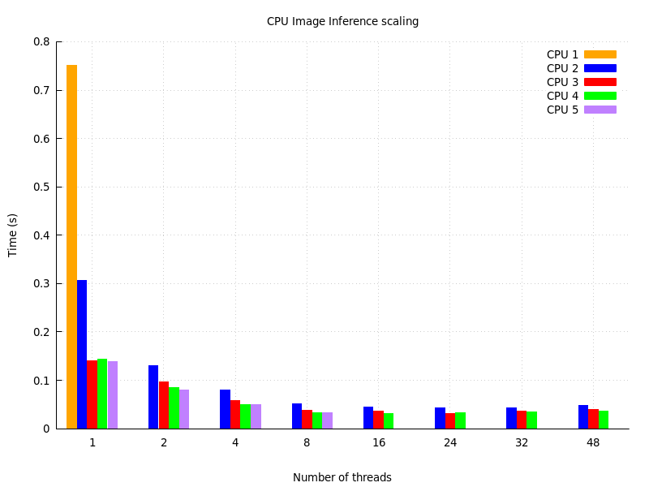
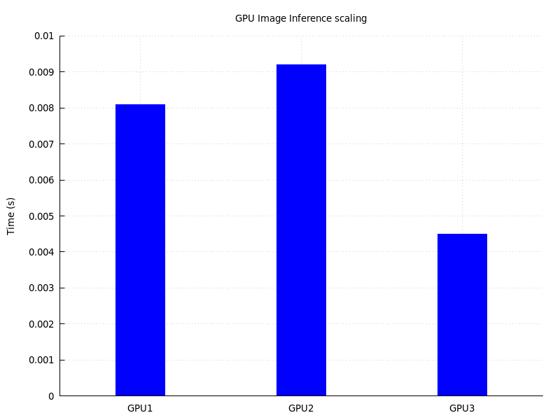
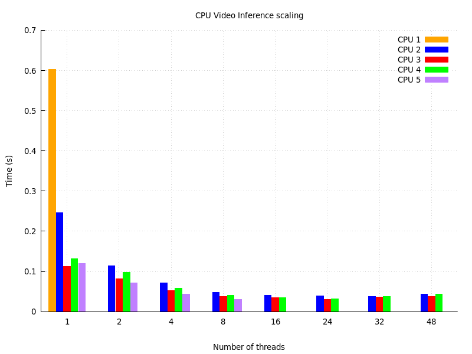
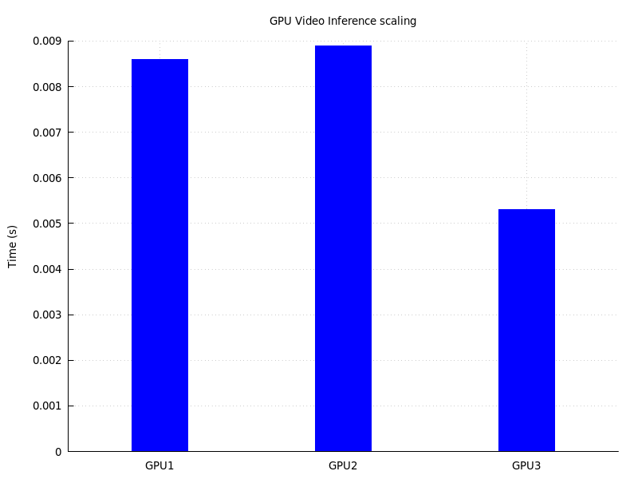

## YOLOv5 

#### Mandown detector

The mandown detector under consideration was developed starting from a YOLOv5 small architecture (yolov5s), which can be found at [this link](https://github.com/ultralytics/yolov5/tree/v5.0).

The model has been trained on a custom dataset to detect two different classes:
- 0: resting
- 1: mandown 


#### PyTorch installation 

We install PyTorch using a conda virtual environment. We use the `requirements.txt` file contained in the [yolov5 repo](https://github.com/ultralytics/yolov5/tree/v5.0) and we install everything via 

`pip install --no-cache-dir -r requirements.txt`

To check the configuration flags of your resulting PyTorch installation (e.g. to see if you compiled with AVX2 or AVX512), you can use (see [this link](https://gist.github.com/mingfeima/bdfb2db3928ca51b795622b29264ef11))

`python -c "import torch; print(torch.__config__.show())"`

If you use a recent PyTorch version (>= 1.11.0), you will get an error of the type:

`AttributeError: 'Upsample' object has no attribute 'recompute_scale_factor'`

This can be fixed, as explained in [this link](https://github.com/ultralytics/yolov5/issues/6948), by removing / commenting the `recompute_scale_factor` argument in the `forward` function inside the `upsampling.py` file (located at `lib/python3.7/site-packages/torch/nn/modules/` in my environment):

```
def forward(self, input: Tensor) -> Tensor:
    return F.interpolate(input, self.size, self.scale_factor, self.mode, self.align_corners,
                         #recompute_scale_factor=self.recompute_scale_factor
                         )
```

#### Image inference

We run image inference on the test dataset using the YOLOv5 `detect.py` script with default parameters (and using N_THREADS to see scalability):

```
MKL_NUM_THREADS=${N_threads} python3 ./detect.py --device cpu --source path/to/data/images/ --weights path/to/mandown/mandown-s.pt --conf 0.25 --iou-thres 0.45
```

These are the results for inference on a set of 51 images of size 480 x 640 on different CPUs:

<table>
  <tr>
    <td> N_threads </td>
    <td>  1 </td>
    <td>  2 </td>
    <td>  4 </td>
    <td>  8 </td>
    <td> 16 </td>
    <td> 24 </td>
    <td> 32 </td>
    <td> 48 </td>
  </tr>
  <tr>
    <td> CPU 1  </td>
    <td> 0.751s </td>
    <td>        </td>
    <td>        </td>
    <td>        </td>
    <td>        </td>
    <td>        </td>
    <td>        </td>
    <td>        </td>    
  </tr>
  <tr>
    <td> CPU 2  </td>
    <td> 0.306s </td>
    <td> 0.130s </td>
    <td> 0.080s </td>
    <td> 0.053s </td>
    <td> 0.045s </td>
    <td> 0.043s </td>
    <td> 0.043s </td>
    <td> 0.048s </td>    
  </tr>
  <tr>
    <td> CPU 3  </td>
    <td> 0.140s </td>
    <td> 0.096s </td>
    <td> 0.058s </td>
    <td> 0.038s </td>
    <td> 0.036s </td>
    <td> 0.032s </td>
    <td> 0.037s </td>
    <td> 0.039s </td>
  </tr>
  <tr>
    <td> CPU 4  </td>
    <td> 0.143s </td>
    <td> 0.085s </td>
    <td> 0.050s </td>
    <td> 0.033s </td>
    <td> 0.031s </td>
    <td> 0.033s </td>
    <td> 0.034s </td>
    <td> 0.037s </td>    
  </tr>
  <tr>
    <td> CPU 5  </td>
    <td> 0.138s </td>
    <td> 0.080s </td>
    <td> 0.049s </td>
    <td> 0.033s </td>
    <td>        </td>
    <td>        </td>
    <td>        </td>
    <td>        </td>    
  </tr>
</table>

where 

- CPU 1: IBM Power9 AC922 (2 x 16-core sockets) @ 2.60 GHz with Power ISA v.3.0 (VSX-3) instructions at 128-bit
- CPU 2: [AMD EPYC 7402](https://www.amd.com/en/product/8816) (2 x 24-core sockets) @ 2.80 GHz with AVX-2 instructions
- CPU 3: [Intel Xeon Platinum 8260](https://www.intel.com/content/www/us/en/products/sku/192474/intel-xeon-platinum-8260-processor-35-75m-cache-2-40-ghz/specifications.html) (2 x 24-core sockets) @ 2.40 GHz with AVX-512 instructions
- CPU 4: [Intel Xeon Platinum 8268](https://www.intel.com/content/www/us/en/products/sku/192481/intel-5eon-platinum-8268-processor-35-75m-cache-2-90-ghz/specifications.html) (2 x 24-core sockets) @ 2.90 GHz with AVX-512 instructions
- CPU 5: 11th Gen Intel Core i9-11950H (1 x 8-core socket) @ 2.60 GHz with AVX-512 instructions

The performance difference between CPU1 and the others, especially at 1 thread, could probably be related to the shorter vector length (missing AVX-512 instructions).



For GPUs instead, with the command

```
python3 ./detect.py --device 0 --source path/to/data/images/ --weights path/to/mandown/mandown-s.pt --conf 0.25 --iou-thres 0.45
```

we find:

- GPU NVIDIA A-100 40GB (associated with CPU 2): 0.0081s

- GPU NVIDIA QUADRO RTX-8000 48GB (associated with CPU 4): 0.0092s

- GPU NVIDIA GeForce RTX-3080 16GB (associated with CPU 5): 0.0045s



#### Video inference

We run video inference on the test dataset using the YOLOv5 `detect.py` script with default parameters (and using N_THREADS to see scalability):

```
MKL_NUM_THREADS=${N_threads} python3 ./detect.py --device cpu --source path/to/data/Ranger_Roll.mp4 --weights path/to/mandown/mandown-s.pt --conf 0.25 --iou-thres 0.45
```

These are the results for inference on a test video of size 384 x 640 on different CPUs:

<table>
  <tr>
    <td> N_threads </td>
    <td>  1 </td>
    <td>  2 </td>
    <td>  4 </td>
    <td>  8 </td>
    <td> 16 </td>
    <td> 24 </td>
    <td> 32 </td>
    <td> 48 </td>
  </tr>
  <tr>
    <td> CPU 1  </td>
    <td> 0.603s </td>
    <td>        </td>
    <td>        </td>
    <td>        </td>
    <td>        </td>
    <td>        </td>
    <td>        </td>
    <td>        </td>    
  </tr>
  <tr>
    <td> CPU 2  </td>
    <td> 0.246s </td>
    <td> 0.114s </td>
    <td> 0.071s </td>
    <td> 0.048s </td>
    <td> 0.040s </td>
    <td> 0.039s </td>
    <td> 0.038s </td>
    <td> 0.044s </td>    
  </tr>
  <tr>
    <td> CPU 3  </td>
    <td> 0.113s </td>
    <td> 0.081s </td>
    <td> 0.052s </td>
    <td> 0.037s </td>
    <td> 0.034s </td>
    <td> 0.030s </td>
    <td> 0.036s </td>
    <td> 0.038s </td>
  </tr>
  <tr>
    <td> CPU 4  </td>
    <td> 0.131s </td>
    <td> 0.098s </td>
    <td> 0.058s </td>
    <td> 0.040s </td>
    <td> 0.035s </td>
    <td> 0.032s </td>
    <td> 0.038s </td>
    <td> 0.043s </td>    
  </tr>  
  <tr>
    <td> CPU 5  </td>
    <td> 0.120s </td>
    <td> 0.072s </td>
    <td> 0.044s </td>
    <td> 0.030s </td>
    <td>        </td>
    <td>        </td>
    <td>        </td>
    <td>        </td>    
  </tr>
</table>

where 

- CPU 1: IBM Power9 AC922 (2 x 16-core sockets) @ 2.60 GHz with Power ISA v.3.0 (VSX-3) instructions at 128-bit
- CPU 2: [AMD EPYC 7402](https://www.amd.com/en/product/8816) (2 x 24-core sockets) @ 2.80 GHz with AVX-2 instructions
- CPU 3: [Intel Xeon Platinum 8260](https://www.intel.com/content/www/us/en/products/sku/192474/intel-xeon-platinum-8260-processor-35-75m-cache-2-40-ghz/specifications.html) (2 x 24-core sockets) @ 2.40 GHz with AVX-512 instructions
- CPU 4: [Intel Xeon Platinum 8268](https://www.intel.com/content/www/us/en/products/sku/192481/intel-xeon-platinum-8268-processor-35-75m-cache-2-90-ghz/specifications.html) (2 x 24-core sockets) @ 2.90 GHz with AVX-512 instructions
- CPU 5: 11th Gen Intel Core i9-11950H (1 x 8-core socket) @ 2.60 GHz with AVX-512 instructions

The performance difference between CPU1 and the others, especially at 1 thread, could probably be related to the shorter vector length (missing AVX-512 instructions).



For GPUs instead, with the command

```
python3 ./detect.py --device 0 --source path/to/data/Ranger_Roll.mp4 --weights path/to/mandown/mandown-s.pt --conf 0.25 --iou-thres 0.45
```

we find:

- GPU NVIDIA A-100 40GB (associated with CPU 2): 0.0086s

- GPU NVIDIA QUADRO RTX-8000 48GB (associated with CPU 4): 0.0089s

- GPU NVIDIA GeForce RTX-3080 16GB (associated with CPU 5): 0.0053s


